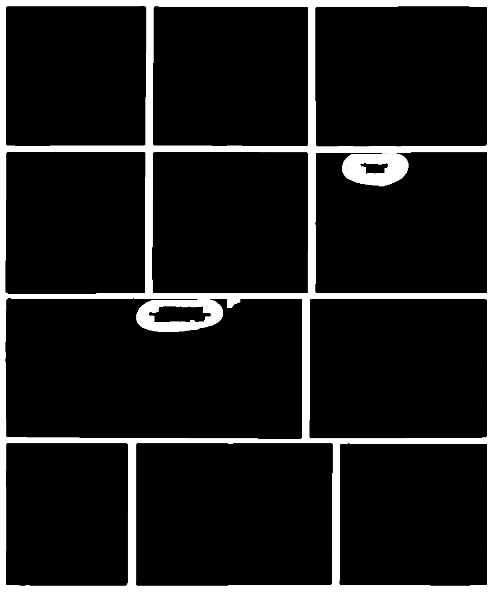

```py
import cv2 as cv
import numpy as np

file = "page.jpg"
orignal_img = cv.imread(file)
height, width = orignal_img.shape[:-1]
```

```py
img = cv.cvtColor(orignal_img, cv.COLOR_BGR2GRAY)
cv.imwrite("bw.jpg", img) 
```


```py
img = cv.medianBlur(img,5)
cv.imwrite("blur.jpg", img) 
```


```py
img = cv.filter2D(src=img, ddepth=-1, kernel=np.array([[0, -1, 0],[-1, 5,-1],[0, -1, 0]]))
cv.imwrite("sharpen.jpg", img) 
```


```py
_, img = cv.threshold(img,0,255,cv.THRESH_BINARY+cv.THRESH_OTSU)
cv.imwrite("otsu.jpg", img) 
```


```py
img = cv.morphologyEx(img, cv.MORPH_OPEN, np.ones((9,9),np.uint8))
cv.imwrite("open.jpg", img) 
```


```py
_, _, img, _ = cv.floodFill(img,np.zeros((height+2, width+2), np.uint8),(0,0),255)
img *= 255
cv.imwrite("floodfill.jpg", img) 
```


```py
img = cv.morphologyEx(img, cv.MORPH_OPEN, np.ones((9,9),np.uint8))
cv.imwrite("floodfill_open.jpg", img) 
```



```py3
contours, _ = cv.findContours(img,cv.RETR_TREE,cv.CHAIN_APPROX_SIMPLE)
min_size = 0.01 # 1% minimum size
i = 0
for cnt in contours:
    if  min_size * img.size < cv.contourArea(cnt) < 0.5 * img.size:
        i += 1
        x,y,w,h = cv.boundingRect(cnt)
        panel = orignal_img[y:y+h, x:x+w]
        cv.imwrite(f"panel_{i:02}.jpg", panel) 
```


