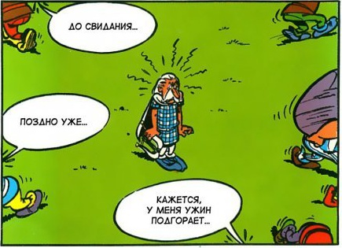
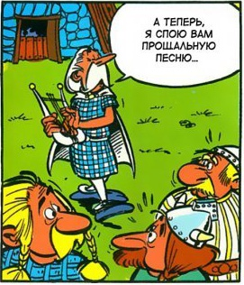
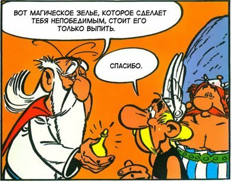

Today some classical computer vision with OpenCV. I needed a dataset of individual comic book panels for some model fine-tuning.

For example take this page from an "Astérix" comic-book:


After counting we see, it contains 11 individual panels and we will extract those with a little list of OpenCV magic.

```py
import cv2 as cv
import numpy as np

file = "page.jpg"
orignal_img = cv.imread(file)
height, width = orignal_img.shape[:-1]
```

### Grayscale

First, convert it to grayscale. Color is just confusing-

```py
img = cv.cvtColor(orignal_img, cv.COLOR_BGR2GRAY)
cv.imwrite("bw.jpg", img) 
```


### Blurring

To get rid of the fine features, apply some median blurring.

```py
img = cv.medianBlur(img, 5)
cv.imwrite("blur.jpg", img) 
```


### Sharpening

Next, re-sharpen the panel edges. Use the basic classical sharpening kernel.

```py
kernel = np.array([[0, -1, 0],
                   [-1, 5,-1],
                   [0, -1, 0]])
img = cv.filter2D(src=img, ddepth=-1, kernel=kernel)
cv.imwrite("sharpen.jpg", img) 
```


### Thresholding

Time to go to binary. For this use [Otsu's method](https://en.wikipedia.org/wiki/Otsu%27s_method) for thresholding. Looks already good, but we want to fille the white patterns in the panels as good as possible to make the contour detection easier.

```py
_, img = cv.threshold(img, 0, 255, cv.THRESH_BINARY + cv.THRESH_OTSU)
cv.imwrite("otsu.jpg", img) 
```


### Opening

To _paint over_ the little white features, apply a [open up](https://en.wikipedia.org/wiki/Opening_(morphology)) the binary mask. Now looks really black already!

```py
kernel = np.ones((9,9), np.uint8)
img = cv.morphologyEx(img, cv.MORPH_OPEN, kernel)
cv.imwrite("open.jpg", img) 
```


### Flood-fill

Finally, to fill the remaining white holes in the black panels, apply a flood-fill filter. As we see, except for two of the panels its returning perfect black rectangles. Having some remaining white holes is fine though, as we regularize the contour detection which smooth over it. 

```py
_, _, img, _ = cv.floodFill(img, np.zeros((height+2, width+2), np.uint8), (0,0), 255)
cv.imwrite("floodfill.jpg", img * 255) 
```


### Contour extraction

The `cv.findContours` method from OpenCV generally finds contours of objects in images. With the pre-processing we made sure that the only sensible objects remaining should be the panels. Nevertheless we filter the found countours by their size with a minimum area and a maximum area.

The countours found will not be perfect four-edge rectangles, therfore we apply `cv.boundingRect` which will fit a rectangle around the contour. This will almost be the same contour but we need the simple _x,y, width, height_ rectangle to select from the original image.


```py3
contours, _ = cv.findContours(img, cv.RETR_TREE, cv.CHAIN_APPROX_SIMPLE)
min_size = 0.01 # 1% minimum size
i = 0
for cnt in contours:
    if  min_size * img.size < cv.contourArea(cnt) < 0.5 * img.size:
        i += 1
        x,y,w,h = cv.boundingRect(cnt)
        panel = orignal_img[y:y+h, x:x+w]
        cv.imwrite(f"panel_{i:02}.jpg", panel) 
```

This will extract the panels looking like this:

|                   |                   |                   |                   |
| ----------------- | ----------------- | ----------------- | ----------------- |
|  |  |  |  |
|  |  |  |  |
|  |  |  |                   |

Pretty good eh! And so easy!

### Bonus: extract text

As a bonus, we extract the text from the saved panels with [Python Tesseract](https://github.com/madmaze/pytesseract).
You might have noticed, that the given comic is in Russian. Therefore when installing Google's [Tesseract OCR](https://github.com/tesseract-ocr/tesseract) you also have to install the extended language packs to also recognize Russian.

With Tesseract installed, getting the text from the images is easy:

```py
texts = {}
for i in range(1, 12):
    # Do OCR with tesseract
    text = pytesseract.image_to_string(Image.open(f"panel_{i:02}.jpg"), lang="rus", nice=1)
    # Remove new-lines, make lower-case and clean white-spaces
    text = text.replace("\n", " ").lower().strip()
    # Reduce to only word-characters
    text = re.sub('[^\w ]+','', text)
    # Reduce multiple spaces in the text to single space
    text = ' '.join(text.split())
    texts[i] = text
```

Sadly, the images are rather small and text not super-readable. Therefore for this page, Tesseract only recognizes the text in 5 out of the 11 panels:

|                                                                                                                       |                          |                                                                   |     |
| --------------------------------------------------------------------------------------------------------------------- | ------------------------ | ----------------------------------------------------------------- | --- |
| чуть позже это мой поларок америксу небольшой знак зачем ты внимания аля укрепления ташишь с дружбы с0бой этот менгир |                          | атеперь я спою вам прошальную                                     |     |
| именем тевтатеса можешь на нас расчитывать вожль жизнестатистикс                                                      | сейчас сообшу всем       |                                                                   |     |
|                                                                                                                       | слишком опасно 3 3 2 8 5 | спасибо за предложение астерикс но я не могу тебе этого позволить |     |